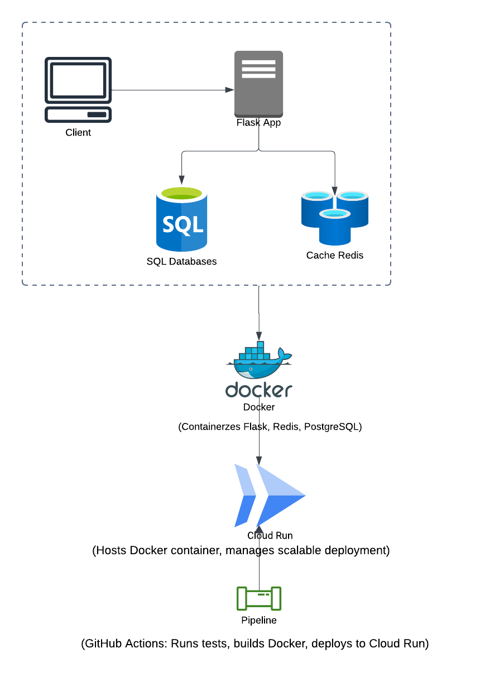

# RBAC-RESTful-API

This project is a Role-Based Access Control (RBAC) API built using Flask. It includes user authentication, role management, and article management. The application uses PostgreSQL for database management, Redis for caching, and the app is containerized using Docker. 

This project also implements a CI/CD pipeline using GitHub Actions and is deployed to Google Cloud Run.

## Table of Contents

1. [Project Overview](#project-overview)
2. [Tech Stack](#tech-stack)
3. [Setup Instructions](#setup-instructions)
4. [Running the Project](#running-the-project)
5. [Running Tests](#running-tests)
6. [Continuous Integration (CI) / Continuous Deployment (CD)](#ci-cd-pipeline)
7. [Deployment](#deployment)
8. [Environment Variables](#environment-variables)
9. [Contributing](#contributing)

---

## Project Overview

This is a RESTful API for a Role-Based Access Control (RBAC) system, where users can be assigned specific roles (e.g., Admin, Editor, Viewer) that determine their permissions in the system. The app provides the following endpoints:

- User Authentication (JWT-based)
- Article Management (CRUD operations)
- Admin Management (e.g., promoting users, managing roles)

---
## Architecture Diagram



---

## Tech Stack

- **Backend**: Flask
- **Database**: PostgreSQL
- **Cache**: Redis
- **Containerization**: Docker
- **CI/CD**: GitHub Actions
- **Deployment**: Google Cloud Run

---

## Setup Instructions

### Prerequisites

Make sure you have the following installed:

- [Docker](https://www.docker.com/get-started)
- [Python 3.x](https://www.python.org/)
- [PostgreSQL](https://www.postgresql.org/download/)
- [Redis](https://redis.io/)

### Clone the Repository

```bash
git clone https://github.com/yourusername/RBAC-RESTful-API.git
cd RBAC-RESTful-API
```
---

## Running the Project
With Docker
1. Build and start containers:

    ```bash
    docker-compose up --build
    ```
2. Access the app:
   - The Flask app will run on http://localhost:5000

---

## Running Tests
Tests are automatically run in the CI pipeline, but you can run them locally as well.
1. Run tests with Docker:

    ```bash
    docker-compose -f docker-compose.test.yml up --build --abort-on-container-exit
    ```
2. Run tests locally (without Docker):

    ```bash
    pytest
    ```

Tests include unit tests for user authentication, article management, and admin role-based functionalities.

---

## CI/CD Pipeline
The CI/CD pipeline is configured with GitHub Actions. On every push or pull request to the main branch, the following actions are triggered:

1. Code Linting and Formatting: Ensures code follows PEP8 and formatting standards.
2. Unit Tests: Runs the test suite using pytest.
3. Docker Image Build: Builds the Docker image for the app.
4. Deployment: If all tests pass, the app is automatically deployed to Google Cloud Run.
5. The pipeline configuration can be found in .github/workflows/ci.yml.
---
## Deployment
This project is deployed to Google Cloud Run. To deploy the project manually:

1. Build the Docker image:

    ```bash
    docker build -t gcr.io/your-project-id/rbac-api .
    ```
2. Deploy to Cloud Run:

    ```bash
    gcloud run deploy --image gcr.io/your-project-id/rbac-api --platform managed
    ```
---

### Environment Variables
Make sure to set the following environment variables in a ```.env``` file:

```env
FLASK_ENV=development
JWT_SECRET_KEY=your_jwt_secret_key
DATABASE_URL=postgresql://flaskuser:flaskpassword@db:5432/flaskdb
REDIS_URL=redis://redis:6379/0
```

---

## Contributing
If you'd like to contribute, please fork the repository and use a feature branch. Pull requests are warmly welcome.

1. Fork the repo and create your branch:

    ```bash
    git checkout -b feature-branch
    ```
2. Push your changes and submit a pull request.#
